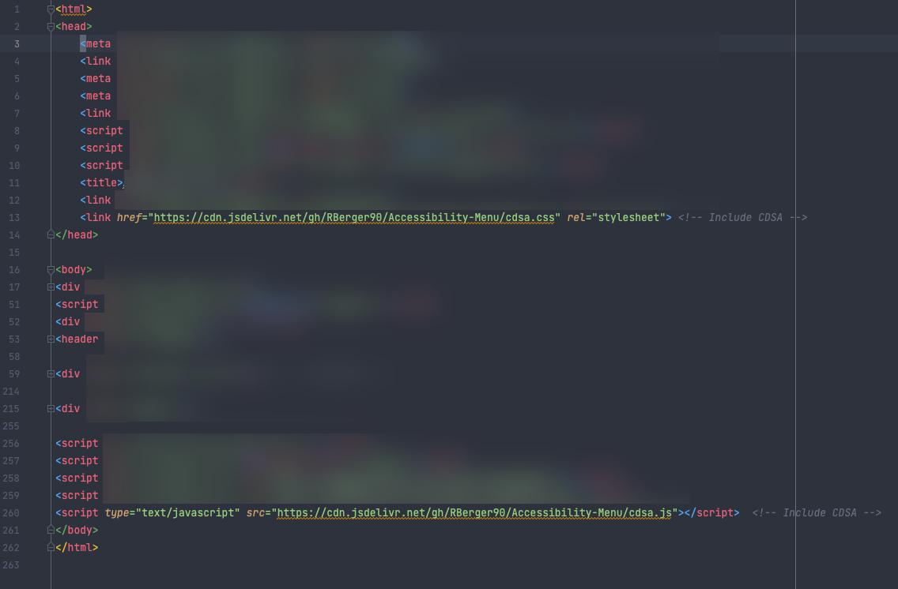
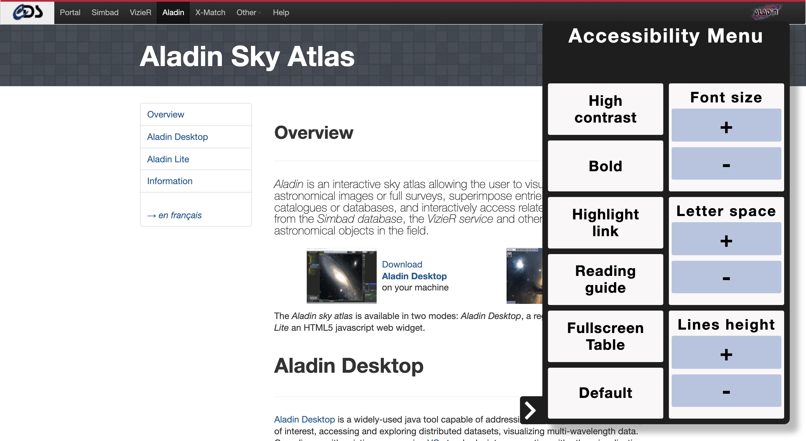
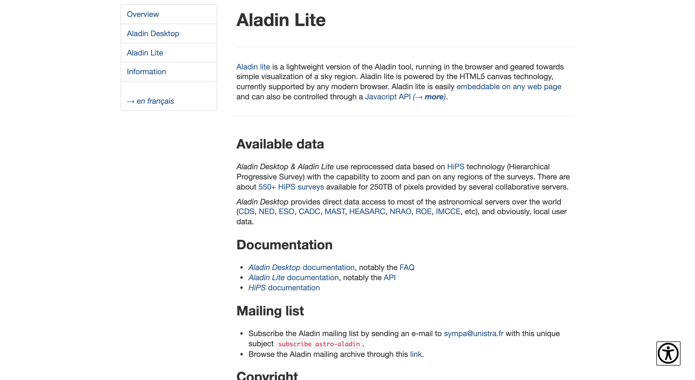
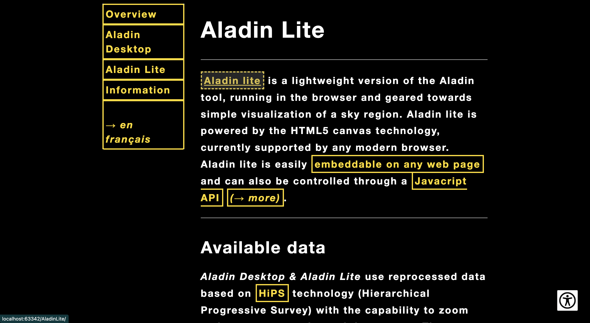

# Accessibility-Menu

This menu is build for the CDS tools (Aladin, Simbad, Vizier...)
Not finish yet.

Project realized in the context of an internship at Strasbourg astronomical observatory.

## Adding the menu

You can add the files directly from github without dowloading them, use these lines to do so (lines 13 and 260):

Or you also can implement them localy by downloading cdsa.js and cdsa.css into your project and link them in your HTML file at the same place as shown just before.

## Preview 

Here you can see how the menu look like :

And then a "before" "after" example of changes you can make on a webpage :

### Before : 

### After :

